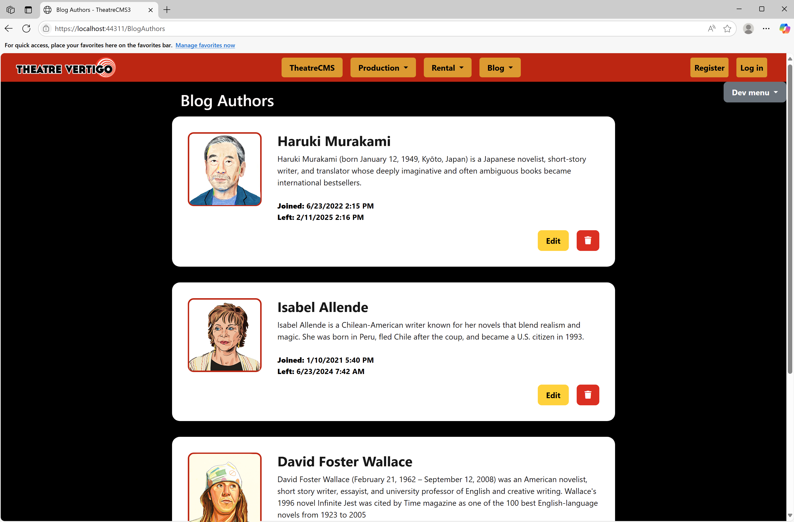
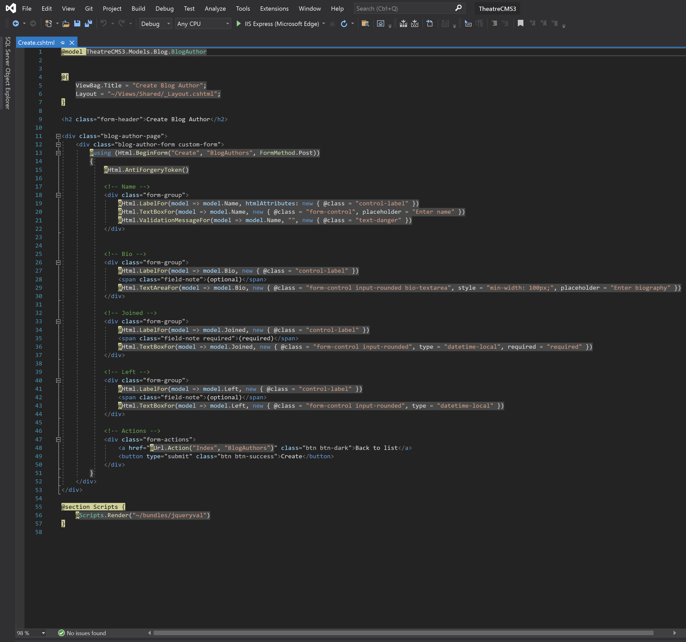
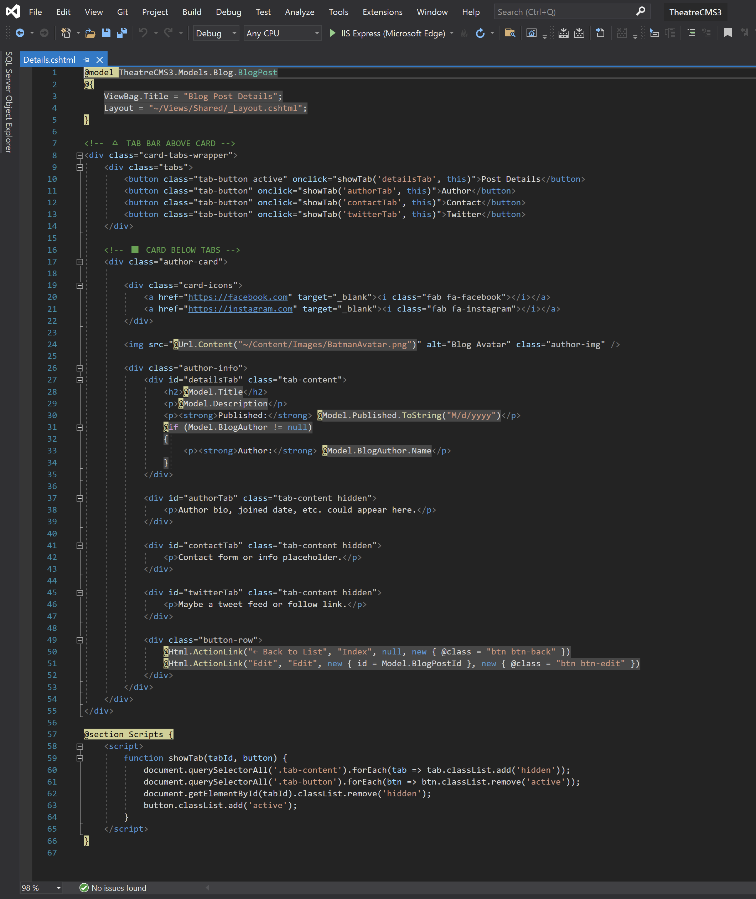
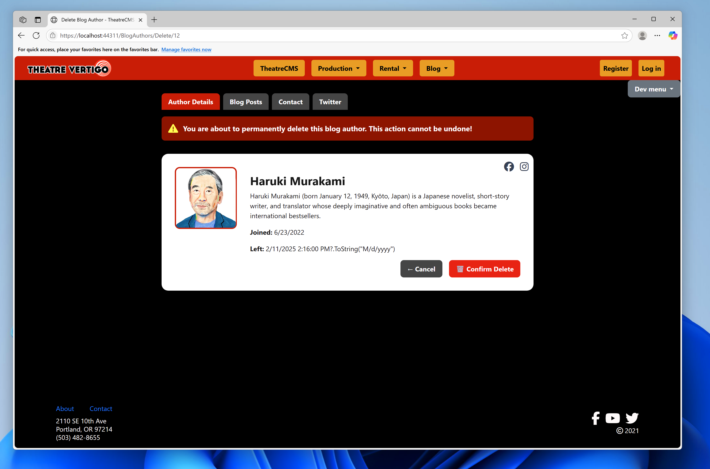
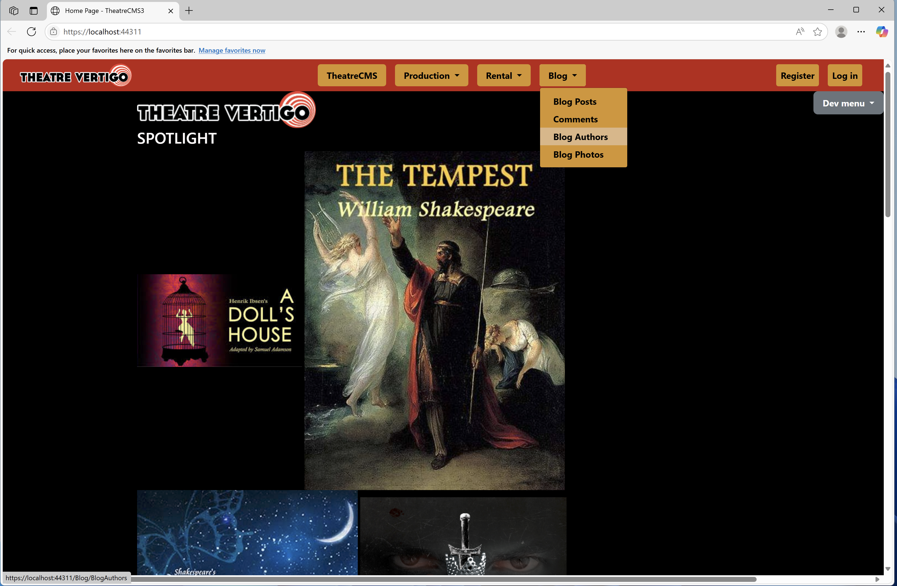
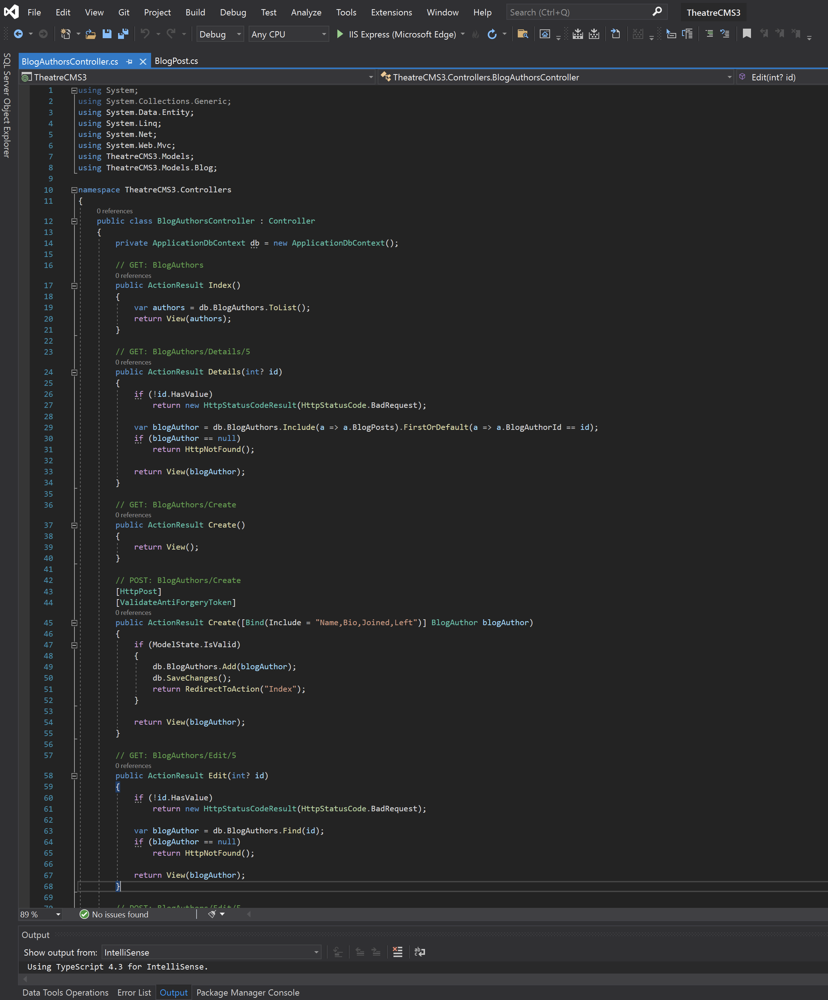

# 🎭 TheatreCMS3
# ASP.NET MVC Theatre Management App

> Built as part of a real-world apprenticeship through **Prosper IT Consulting** via *The Tech Academy*, TheatreCMS3 is a dynamic ASP.NET MVC web application created to manage blog content for a fictional theatre group: **Theatre Vertigo**. This project follows Agile methodology with full CRUD support, SQL integration, responsive UI, and modern developer tools.

---

## 📑 Table of Contents

- [🚀 Project Overview](#project-overview)
- [💡 Key Features](#key-features)
- [🖥️ User Interface](#user-interface)
- [🔀 Git & Version Control](#git--version-control)
- [🚀 Azure DevOps & Agile Process](#azure-devops--agile-process)
- [🗃️ SQL Server & Database Integration](#sql-server--database-integration)
- [🗑️ BlogAuthor Delete Example](#blogauthor-delete-example)
- [🧠 Controllers & Forms](#controllers--forms)
- [📌 Final Thoughts](#final-thoughts)

---

## Project Overview

🚀 **TheatreCMS3** is a comprehensive theatre content management system built using **C#, ASP.NET MVC**, and **Entity Framework**. Designed for a fictional theatre group (**Theatre Vertigo**), this platform enables staff to manage blog authors and their associated posts through a tab-based UI that displays Author Details and Blog Posts.

---

## Key Features

💡 Core capabilities include:

- ✅ Full CRUD for Blog Authors and Blog Posts
- 📆 DateTime picker support for `Joined` and `Left` values
- 🎨 Tabbed interface for toggling between Author Info & Posts
- 📱 Responsive design with custom Bootstrap 4 styling
- 🖼️ Avatar images for author branding
- 🔗 Social media icons (Font Awesome)
- 💥 Confirm deletion with visual warning
- 🧠 Model validation & error feedback

---

## User Interface

🖥️ Highlights of the UI:

### Blog Authors Index View  


### Create Blog Author Form  


### Blog Post Details View  


### BlogAuthor Delete Confirmation  


### Home Page  


---

## Git & Version Control

🔀 Version control handled using **Git** and hosted on **GitHub**:

- Feature branching
- Pull Requests (PRs) for reviews
- Merge and migration conflict resolution
- `.gitignore` to exclude secrets and build files

---

## Azure DevOps & Agile Process

🚀 Managed under a real Agile Scrum framework:

- Sprint Planning & Task Estimation
- Daily Standups
- Sprint Retrospectives
- Azure Boards for tracking progress

---

## SQL Server & Database Integration

🗃️ Entity Framework with SQL Server used for backend:

- Code-First Migrations
- SQL Server Explorer to inspect DB schema
- Example migration command:
  ```bash
  Add-Migration InitialCreate
  Update-Database
  ```

---

## BlogAuthor Delete Example

🗑️ Delete confirmation screen emphasizes irreversible action:

```html
<div class="alert alert-danger">
  ⚠️ You are about to permanently delete this blog author. This action cannot be undone!
</div>
```


---

## Controllers & Forms

🧠 MVC controllers handle logic and data flow:

- Example Controller:
  

- Razor Form:
  ```csharp
  @Html.TextBoxFor(model => model.Name, new { @class = "form-control" })
  ```

- HTML5 `datetime-local` used for joined/left fields.

---

## Final Thoughts

📌 TheatreCMS3 showcases:

- Full-stack ASP.NET MVC development
- Agile team collaboration
- Responsive UI and Bootstrap integration
- SQL Server with EF
- Real-world apprenticeship results

> 🎯 This project represents a hands-on, industry-relevant experience using professional tools and practices.
