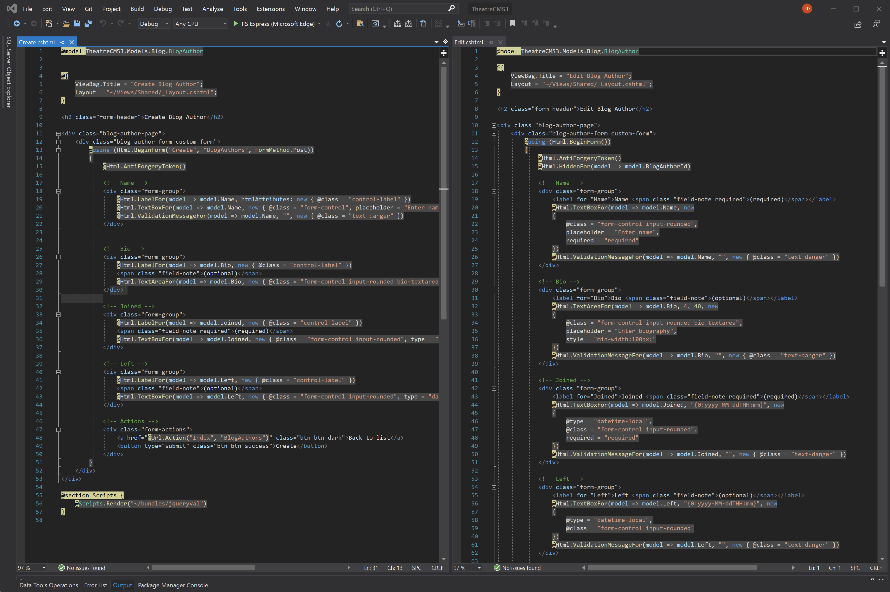
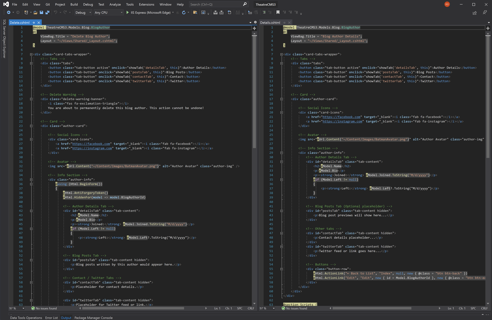
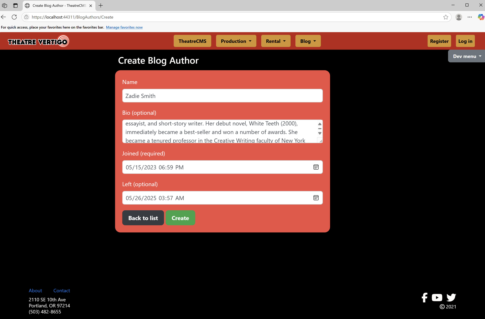
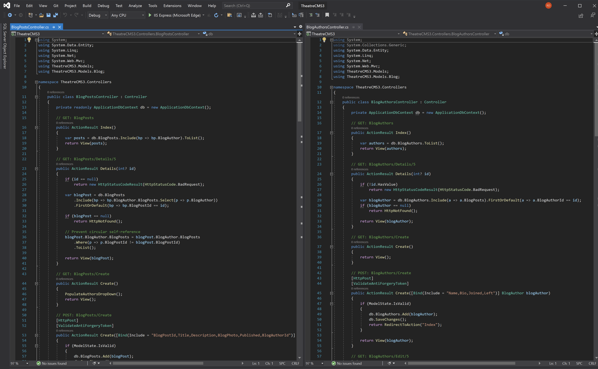

# 🎭 TheatreCMS3 🎭  
## ASP.NET MVC Theatre Management App

> Built as part of a real-world apprenticeship through **Prosper IT Consulting**, TheatreCMS3 is a dynamic ASP.NET MVC web application created to manage blog content for a fictional theatre group: **Theatre Vertigo**.
> This project follows Agile/Scrum methodology with full CRUD support, SQL integration, responsive UI, and modern dev tools.

---

## Table of Contents

* [Project Overview](#project-overview)
* [Key Features](#key-features)
* [User Interface](#user-interface)
* [BlogAuthor Models](#blogauthor-models)
* [BlogAuthor Views](#blogauthor-views)
* [BlogAuthor Delete Example](#blogauthor-delete-example)
* [Controllers and Forms](#controllers-and-forms)
* [BlogAuthor Controller Logic](#blogauthor-controller-logic)

---

## Project Overview

### Application
🚀 **TheatreCMS3** is a comprehensive theatre content management system built using **C#, ASP.NET MVC**, and **Entity Framework**.

My role was to develop *Blog Authors* that enables staff to manage said authors and their associated posts through a tab-based UI that displays Author Detail Cards and Blog Posts. I also worked on front-end UI/UX to create an enjoyable user-interface and experience through clean navigation and user-functionality. I'm proud of the work the team and I accomplished over the 2-week Sprint, providing deliverables on-schedule and to client satisfaction.

---

## Key Features

💡 Core capabilities include:

- Full CRUD for Blog Authors and Blog Posts  
- DateTime picker support for `Joined` and `Left` values  
- Tabbed interface for toggling between Author Info & Posts  
- Responsive design with custom Bootstrap 4 styling  
- Avatar images for author branding  
- Social media icons (Font Awesome)  
- Confirm deletion with visual warning  
- Model validation & error feedback  

---

## User Interface

Highlights of the UI:

### Home Page  

---

## BlogAuthor Models

Example Models:  

---

## Blog Authors Card

---

## BlogAuthor Views

CRUD Views:  

---

## BlogAuthor Delete Example

Details/Delete Confirmation  
  

---

## Controllers and Forms

### Create Blog Author Form (UI)  

### Create Blog Author Form (Code)  

---

## BlogAuthor Controller Logic

---

## Development Tools & AI Integration

The TheatreCMS3 project was developed in **Visual Studio** using a structured MVC architecture powered by **ASP.NET**, **Entity Framework**, and SQL Server integration.

To increase velocity, accuracy, and reduce time spent on boilerplate logic and syntax troubleshooting, I utilized **AI-assisted development tools**, including:

- 🤖 **GitHub Copilot**: Autocompleted controller methods, view logic, and model properties with context-aware suggestions. This greatly accelerated repetitive coding tasks while helping me stay focused on logic and structure.

- 🧠 **ChatGPT (aka the “Ninja”)**: Assisted in real-time problem-solving during debugging, migrations, view-model issues, and Markdown rendering challenges. Whenever I hit a wall, ChatGPT helped me break through with practical, immediate guidance.

> These tools didn’t replace critical thinking—they **augmented** it. I used them as a force multiplier to become a more agile, resourceful, and modern developer, capable of solving complex problems faster and with greater confidence.

---

## Git and Version Control

Version control handled using **Git** and hosted on **GitHub**:

- Feature branching  
- Pull Requests (PRs) for reviews  
- Merge and migration conflict resolution  
- `.gitignore` to exclude secrets and build files  

---

## Azure DevOps and Agile Process

Managed under a real Agile Scrum framework:

- Sprint Planning & Task Estimation  
- Daily Standups  
- Sprint Retrospectives  
- Azure Boards for tracking progress  

---

## SQL Server and Database Integration

Entity Framework with SQL Server used for backend:

- Code-First Migrations  
- SQL Server Explorer to inspect DB schema  

## Final Thoughts

**TheatreCMS3 Showcases:**

- ✅ Full-stack ASP.NET MVC development  
- 🤝 Agile team collaboration  
- 🎨 Responsive UI and Bootstrap integration  
- 🗃️ SQL Server with Entity Framework  
- 💼 Real-world apprenticeship results
